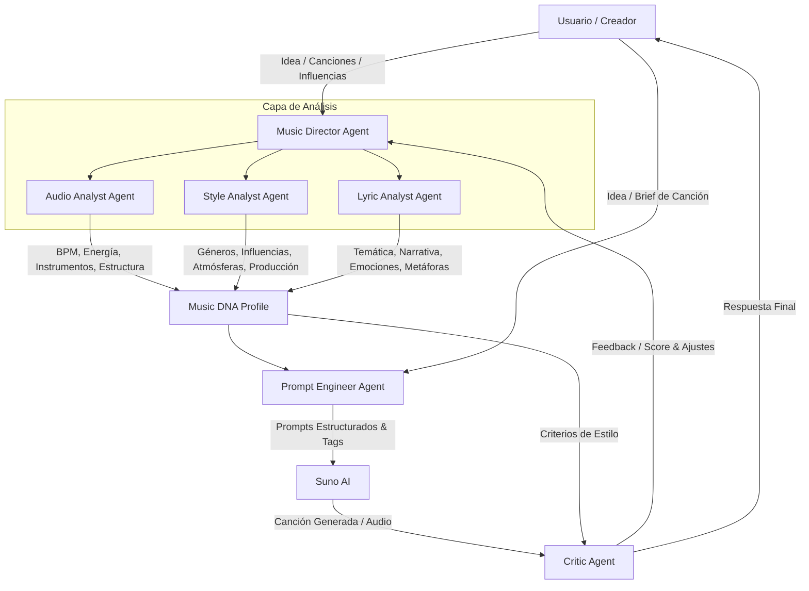

# Arquitectura de Sistema: MusicIA (Productores & Prompting para Suno)

## Metadata

- Project ID: `musicIA`
- Version: `1.0`
- Status: `APPROVED`
- Last verified: `2026-07-21`
- Approved by: `jmrs9206`

---

## 1. Visión General

MusicIA es un sistema orquestado por agentes de IA diseñado para aprender e interpretar la **identidad musical** de un artista (canciones propias y referencias/influencias) y actuar como un productor musical inteligente que genera prompts optimizados y profesionales para **Suno AI**, evaluando posteriormente las entregas creadas.

---

## 2. Diagrama de Arquitectura del Flujo de Agentes



---

## 3. Red de Agentes y Responsabilidades

| Agente | Nombre de Rol | Responsabilidad Principal | Artefactos de Salida |
|---|---|---|---|
| **Music Director** | `@music_director` | Orquesta la red de agentes, sintetiza análisis y mantiene la identidad musical. | `knowledge/mi_identidad_musical.md` |
| **Audio Analyst** | `@audio_analyst` | Extrae espectro, tempo (BPM), energía, armónicos e instrumentación de archivos MP3/WAV/FLAC. | `analysis/audio_analysis.json` |
| **Style Analyst** | `@style_analyst` | Deduce géneros, subgéneros, micro-géneros, atmósferas y técnicas de producción. | `analysis/style_analysis.json` |
| **Lyric Analyst** | `@lyric_analyst` | Analiza estructura lírica, rima, métrica, emociones, temas recurrentes y figuras retóricas. | `analysis/lyric_analysis.json` |
| **Prompt Engineer** | `@prompt_engineer` | Transforma el Music DNA Profile y el brief del usuario en prompts optimizados para Suno. | `prompts/suno_prompts.json` |
| **Critic Agent** | `@critic_agent` | Evalúa si la canción producida por Suno se alinea con la identidad del artista. | `analysis/critic_report.json` |

---

## 4. Estructura de Almacenamiento y Base de Conocimiento (`knowledge/`)

```text
/home/jmrs/Documentos/PROYECTOS/JMRS/MusicIA
├── knowledge/                        # Base de conocimiento persistente
│   ├── mi_identidad_musical.md       # Perfil consolidado (Music DNA)
│   ├── mis_preferencias.json         # Parámetros, reglas de estilo y restricciones Suno
│   └── mis_influencias.json          # Mapeo de artistas, bandas y referencias
├── songs/                            # Repositorio de audios
│   ├── propias/                      # Obras y demos del usuario
│   └── referencias/                  # Influencias y canciones externas
├── analysis/                         # Informes JSON estructurados por los agentes analistas
└── prompts/                          # Registro de prompts generados y biblioteca de plantillas
    ├── templates_suno.json           # Estructura de tags Suno ([Intro], [Verse], etc.)
    └── historico/                    # Histórico de prompts e iteraciones
```

---

## 5. Especificación del Prompting para Suno AI

El **Prompt Engineer Agent** genera respuestas compuestas por tres elementos clave optimizados para el motor de Suno:

1. **Style Prompt (Style Description - Máx. 120 caracteres)**:
   - Formato: `[Género principal], [Subgéneros], [BPM], [Instrumentación clave], [Atmósfera], [Estilo vocal]`
   - Ejemplo: `Alternative Indie Rock, 95 BPM, acoustic guitars, vintage synth, melancholic atmosphere, raw vocal`

2. **Lyrics & Metatags (Estructura de Canción)**:
   - Uso obligatorio de metatags de estructura de Suno:
     - `[Intro]`, `[Verse 1]`, `[Pre-Chorus]`, `[Chorus]`, `[Guitar Solo]`, `[Bridge]`, `[Outro]`, `[Fade Out]`

3. **Title / Theme**:
   - Título sugerido y conceptualización lírica adaptada a la narrativa del usuario.

---

## 6. Criterios de Aceptación del Sistema (`Target State`)

- [x] Estructura física de carpetas creada (`knowledge/`, `songs/`, `analysis/`, `prompts/`).
- [x] Plantillas iniciales de identidad creadas.
- [ ] Implementación de scripts/módulos para `Audio Analyst`, `Style Analyst` y `Lyric Analyst`.
- [ ] Implementación del motor de generación de prompts para Suno.
- [ ] Bucle de evaluación del `Critic Agent`.
