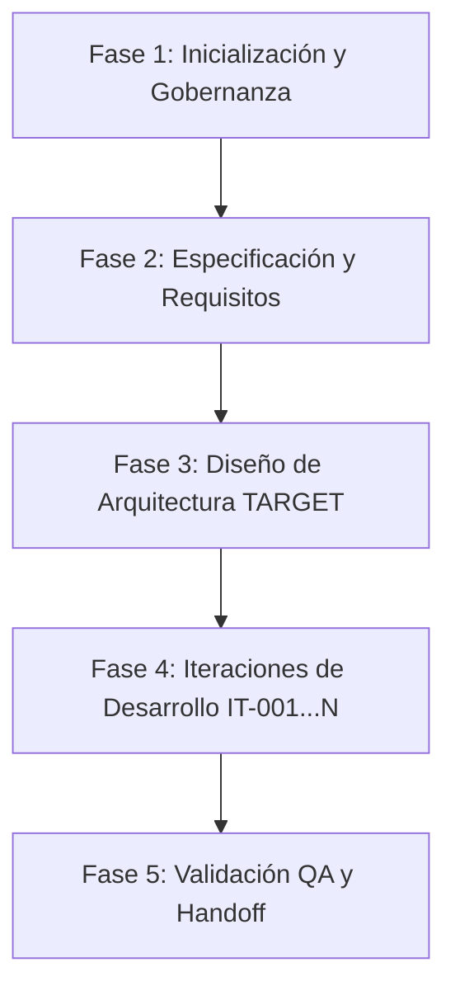

# Workflow del Proyecto: MusicIA

## Visión General del Workflow

El proyecto `MusicIA` se rige bajo el marco del **Orquestador de Agentes IA**. Su objetivo principal es la implementación de la red de 6 agentes musicales y la base de conocimiento para la generación optimizada en Suno AI.

---

## Estado Actual del Workflow

- **Fase Activa**: `Fase 3: Diseño de Arquitectura TARGET` (Completada) -> Preparando `Fase 4: Iteraciones de Desarrollo`
- **Siguiente Fase**: `Iteración IT-001: Implementación de Módulos Base y Motor de Agentes`
- **Estado de Aprobación**: `APPROVED`

---

## Mapa de Fases del Workflow

### Detalle de Fases

#### Fase 1: Inicialización y Gobernanza (COMPLETADA)
- [x] Copiar marco `.agents/`, `templates/`, `docs/`, `GEMINI.md` desde `orquestadorIA`.
- [x] Crear repositorio Git e integrar con GitHub.

#### Fase 2: Especificación y Requisitos (COMPLETADA)
- [x] Definir requisitos de la red de 6 agentes.
- [x] Definir estructura del repositorio y base de conocimiento (`knowledge/`, `songs/`, `analysis/`, `prompts/`).

#### Fase 3: Diseño de Arquitectura TARGET (COMPLETADA)
- [x] Elaborar [.ai/ARCHITECTURE.md](file:///home/jmrs/Documentos/PROYECTOS/JMRS/MusicIA/.ai/ARCHITECTURE.md) detallando el flujo de agentes (Audio Analyst, Style Analyst, Lyric Analyst, Music Director, Prompt Engineer, Critic Agent).
- [x] Actualizar roles específicos en [.agents/agents.md](file:///home/jmrs/Documentos/PROYECTOS/JMRS/MusicIA/.agents/agents.md).

#### Fase 4: Iteraciones de Desarrollo (EN CURSO)
- [ ] **IT-001**: Estructura de módulos de código y contratos de agentes.
- [ ] **IT-002**: Agentes Analistas (Audio Analyst, Style Analyst, Lyric Analyst).
- [ ] **IT-003**: Agente Director Musical (Music DNA Profile synthesis) & Prompt Engineer Agent para Suno.
- [ ] **IT-004**: Critic Agent & interfaz de interacción con el usuario.

#### Fase 5: Validación y Entrega
- [ ] Pruebas QA completas de generación de prompts y feedback.
