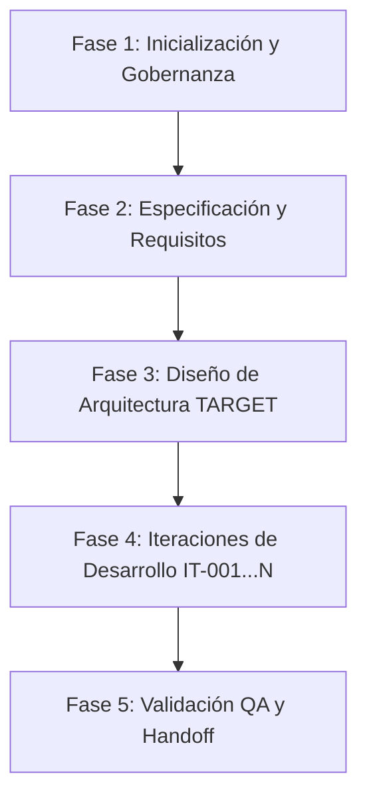

# Workflow del Proyecto: MusicIA

## Visión General del Workflow

El proyecto `MusicIA` se rige bajo el marco del **Orquestador de Agentes IA**. El desarrollo avanza mediante fases estructuradas y contratos de iteración rigurosos.

---

## Estado Actual del Workflow

- **Fase Activa**: `Fase 1: Inicialización & Gobernanza` (Completando)
- **Siguiente Fase**: `Fase 2: Especificación y Arquitectura`
- **Estado de Aprobación**: `NEEDS_APPROVAL` (Esperando confirmación del usuario sobre el enfoque y módulos de MusicIA)

---

## Mapa de Fases del Workflow

### Detalle de Fases

#### Fase 1: Inicialización y Gobernanza (COMPLETADA)
- [x] Copiar marco `.agents/`, `templates/`, `docs/`, `GEMINI.md` desde `orquestadorIA`.
- [x] Crear repositorio Git e integrar con GitHub.
- [x] Generar paquete de control `.ai/` (`PROJECT_CHARTER.md`, `PROJECT_CONSTITUTION.md`, `PROJECT_CONTEXT.md`, `REQUIREMENTS.md`, `ACCEPTANCE_CRITERIA.md`).

#### Fase 2: Especificación y Requisitos (EN CURSO / SIGUIENTE)
- [ ] Definir los módulos funcionales específicos de `MusicIA` (ej. Generador de música, procesamiento de audio, interfaz visual, APIs de IA).
- [ ] Completar la matriz de requisitos y criterios de aceptación específicos.

#### Fase 3: Diseño de Arquitectura TARGET
- [ ] Definir la pila tecnológica del proyecto (Frontend, Backend, IA/Audio, DB).
- [ ] Elaborar `ARCHITECTURE.md` y registros de decisión (`ADR.md`).

#### Fase 4: Iteraciones de Desarrollo
- [ ] Planificación de tareas (`TASK_CONTRACT.md`).
- [ ] Ejecución por agentes especializados con evidencia (`EVIDENCE_LOG.md`).
- [ ] Revisión independiente (`revisar_cambios.md`).

#### Fase 5: Validación y Entrega
- [ ] Evaluación QA.
- [ ] Reporte de iteración (`ITERATION_REPORT.md`).

---

## Roles Activos en el Workflow

| Rol | Responsabilidad | Estado |
|---|---|---|
| `@director` | Alineación global y supervisión | Activo |
| `@product` | Definición de charter y requisitos | Activo |
| `@context` | Mantenimiento de hechos verificados | Activo |
| `@architect` | Diseñar la estructura técnica de MusicIA | Pendiente (Fase 3) |
| `@planner` | Diseñar tareas de iteración | Pendiente (Fase 4) |
