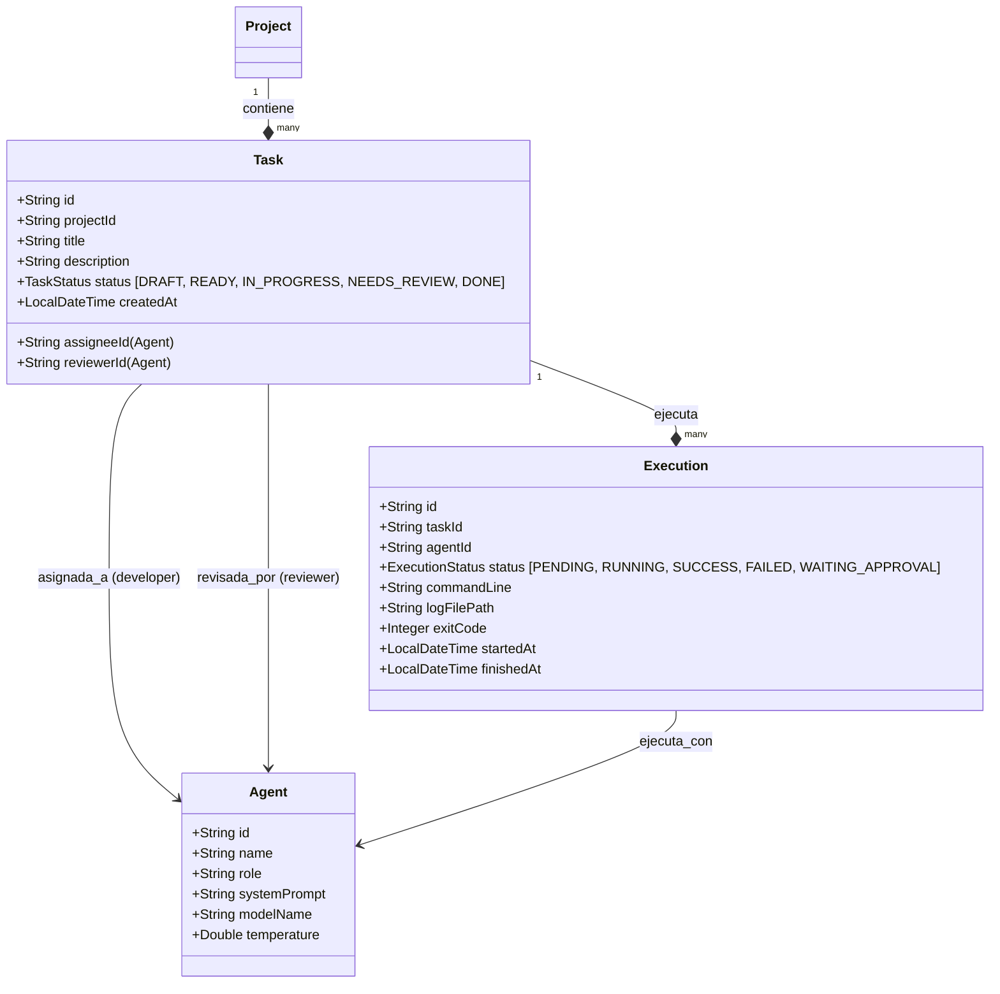

# ADR-003: Diseño de la Capa de Orquestación y Ejecución de Agentes

## Estado
PROPUESTO

## Fecha
2026-07-14

## Contexto
El **Project Registry** (MVP) permite dar de alta proyectos locales, pero carece de la lógica para asignar agentes, definir tareas como contratos de entrada/salida y ejecutar comandos de forma segura (ej. invocar a Gemini CLI, correr builds o realizar tests).
Necesitamos diseñar la **Capa de Orquestación** que gobierne:
1. El registro de agentes e identidades de rol (`@developer`, `@reviewer`, etc.).
2. La definición y ciclo de vida de tareas y sus ejecuciones.
3. El motor de ejecución local de subprocesos CLI (seguro y no bloqueante).
4. La puerta de control humana para operaciones de alto riesgo o revisiones cruzadas.

## Decisiones

### 1. Modelo de Dominio de Orquestación
Definiremos tres entidades clave adicionales en el backend Java:

### 2. Motor de Ejecución Local (CLI Runner)
- **Tecnología:** Utilizaremos `ProcessBuilder` de Java ejecutándose en hilos de fondo gestionados por un `TaskExecutor` de Spring (`ThreadPoolTaskExecutor`).
- **Seguridad (Sanitización del Entorno):** Al instanciar el proceso, limpiaremos las variables de entorno del sistema (`processBuilder.environment().clear()`) y solo inyectaremos las variables configuradas explícitamente y necesarias para el proyecto (por ejemplo, `PATH`, `JAVA_HOME`, `NODE_ENV` y `GEMINI_API_KEY` si es necesario). Esto evita fugas accidentales de secretos del host hacia los subprocesos del agente.
- **Trazabilidad:** La salida unificada (`redirectErrorStream(true)`) se escribirá en tiempo real a un archivo `.log` físico dentro de la ruta `.ai/logs/` del proyecto.

### 3. Puerta de Control Humana (Human Gate)
- **Intersección de Riesgo:** Antes de ejecutar cualquier comando de subproceso, el orquestador analizará la línea de comando (`commandLine`).
- **Patrones de Riesgo:** Si el comando contiene palabras clave peligrosas (ej. `git push`, `npm publish`, `docker push`, `deploy`, `rm -rf /`), la ejecución no se iniciará de forma automática.
- **Acción:** El estado de la `Execution` pasará a `WAITING_APPROVAL`, y el backend emitirá una alerta.
- **Endpoints de Aprobación:**
  - `POST /api/executions/{id}/approve` -> Inicia o reanuda el subproceso.
  - `POST /api/executions/{id}/reject` -> Marca la ejecución como `FAILED` con la observación de rechazo por el usuario.

### 4. Regla de Revisión Cruzada (No Auto-Aprobación)
- El endpoint para transicionar una tarea a `DONE` verificará que el revisor asignado (`reviewerId`) a la tarea sea físicamente distinto del asignado para la ejecución (`assigneeId`). Si coinciden, se rechazará la transición con un error de negocio (`400 Bad Request` / `CROSS_REVIEW_REQUIRED`).

## Consecuencias
- **Pros:**
  - Garantiza aislamiento de variables de entorno de nivel de sistema evitando leaks de tokens del host.
  - Otorga control completo al usuario sobre acciones destructivas o externas (Push / Deploy).
  - Permite auditoría detallada almacenando los logs exactos de cada ejecución de agente en archivos de texto persistentes.
- **Contras:**
  - El análisis de comandos peligrosos por String-matching es básico; comandos maliciosos muy sofisticados podrían evadirlo si no se restringen también los permisos a nivel del sistema operativo.
